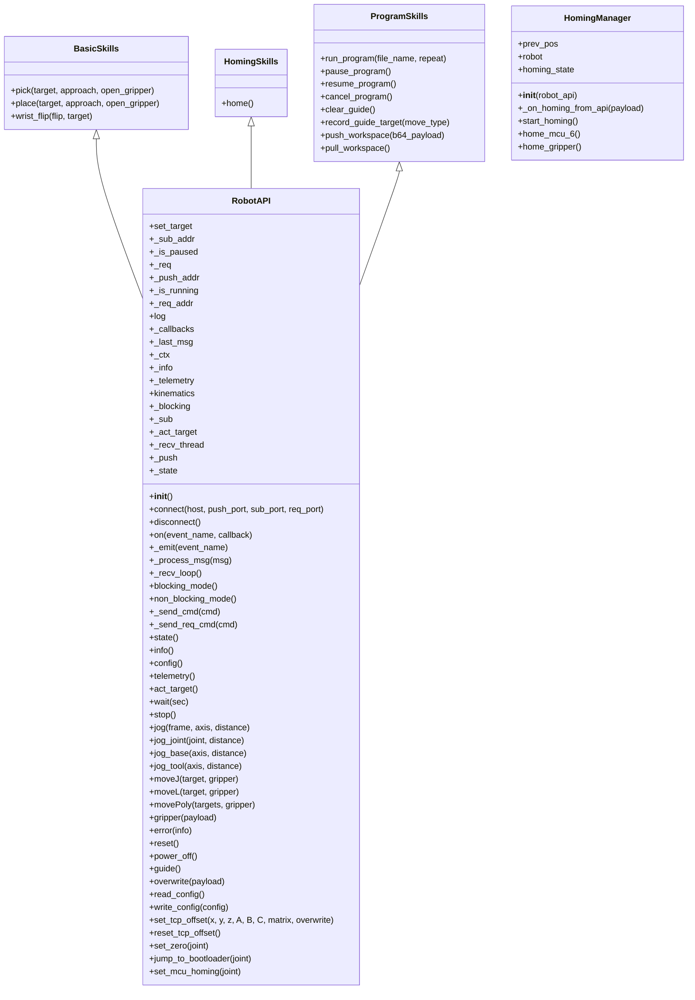

# Client Architecture

```mermaid
classDiagram
    class RobotAPI {
        +set_target
        +_sub_addr
        +_is_paused
        +_req
        +_push_addr
        +_is_running
        +_req_addr
        +log
        +_callbacks
        +_last_msg
        +_ctx
        +_info
        +_telemetry
        +kinematics
        +_blocking
        +_sub
        +_act_target
        +_recv_thread
        +_push
        +_state
        +__init__()
        +connect(host, push_port, sub_port, req_port)
        +disconnect()
        +on(event_name, callback)
        +_emit(event_name)
        +_process_msg(msg)
        +_recv_loop()
        +blocking_mode()
        +non_blocking_mode()
        +_send_cmd(cmd)
        +_send_req_cmd(cmd)
        +state()
        +info()
        +config()
        +telemetry()
        +act_target()
        +wait(sec)
        +stop()
        +jog(frame, axis, distance)
        +jog_joint(joint, distance)
        +jog_base(axis, distance)
        +jog_tool(axis, distance)
        +moveJ(target, gripper)
        +moveL(target, gripper)
        +movePoly(targets, gripper)
        +gripper(payload)
        +error(info)
        +reset()
        +power_off()
        +guide()
        +overwrite(payload)
        +read_config()
        +write_config(config)
        +set_tcp_offset(x, y, z, A, B, C, matrix, overwrite)
        +reset_tcp_offset()
        +set_zero(joint)
        +jump_to_bootloader(joint)
        +set_mcu_homing(joint)
    }
    BasicSkills <|-- RobotAPI
    HomingSkills <|-- RobotAPI
    ProgramSkills <|-- RobotAPI
    class BasicSkills {
        +pick(target, approach, open_gripper)
        +place(target, approach, open_gripper)
        +wrist_flip(flip, target)
    }
    class HomingManager {
        +prev_pos
        +robot
        +homing_state
        +__init__(robot_api)
        +_on_homing_from_api(payload)
        +start_homing()
        +home_mcu_6()
        +home_gripper()
    }
    class HomingSkills {
        +home()
    }
    class ProgramSkills {
        +run_program(file_name, repeat)
        +pause_program()
        +resume_program()
        +cancel_program()
        +clear_guide()
        +record_guide_target(move_type)
    }
    class ProgramSkills {
        +push_workspace(b64_payload)
        +pull_workspace()
    }
```