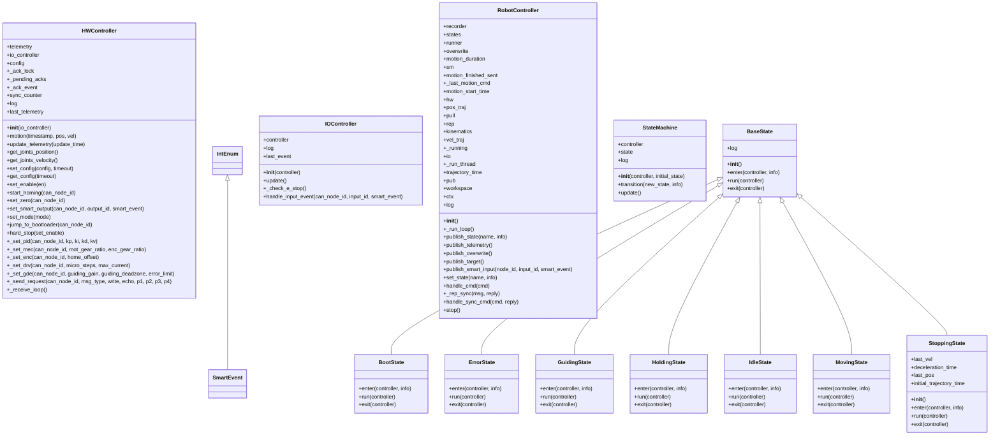

# Controller Architecture

```mermaid
classDiagram
    class HWController {
        +telemetry
        +io_controller
        +config
        +_ack_lock
        +_pending_acks
        +_ack_event
        +sync_counter
        +log
        +last_telemetry
        +__init__(io_controller)
        +motion(timestamp, pos, vel)
        +update_telemetry(update_time)
        +get_joints_position()
        +get_joints_velocity()
        +set_config(config, timeout)
        +get_config(timeout)
        +set_enable(en)
        +start_homing(can_node_id)
        +set_zero(can_node_id)
        +set_smart_output(can_node_id, output_id, smart_event)
        +set_mode(mode)
        +jump_to_bootloader(can_node_id)
        +hard_stop(set_enable)
        +_set_pid(can_node_id, kp, ki, kd, kv)
        +_set_mec(can_node_id, mot_gear_ratio, enc_gear_ratio)
        +_set_enc(can_node_id, home_offset)
        +_set_drv(can_node_id, micro_steps, max_current)
        +_set_gde(can_node_id, guiding_gain, guiding_deadzone, error_limit)
        +_send_request(can_node_id, msg_type, write, echo, p1, p2, p3, p4)
        +_receive_loop()
    }
    class SmartEvent {
    }
    IntEnum <|-- SmartEvent
    class IOController {
        +controller
        +log
        +last_event
        +__init__(controller)
        +update()
        +_check_e_stop()
        +handle_input_event(can_node_id, input_id, smart_event)
    }
    class RobotController {
        +recorder
        +states
        +runner
        +overwrite
        +motion_duration
        +sm
        +motion_finished_sent
        +_last_motion_cmd
        +motion_start_time
        +hw
        +pos_traj
        +pull
        +rep
        +kinematics
        +vel_traj
        +_running
        +io
        +_run_thread
        +trajectory_time
        +pub
        +workspace
        +ctx
        +log
        +__init__()
        +_run_loop()
        +publish_state(name, info)
        +publish_telemetry()
        +publish_overwrite()
        +publish_target()
        +publish_smart_input(node_id, input_id, smart_event)
        +set_state(name, info)
        +handle_cmd(cmd)
        +_rep_sync(msg, reply)
        +handle_sync_cmd(cmd, reply)
        +stop()
    }
    class StateMachine {
        +controller
        +state
        +log
        +__init__(controller, initial_state)
        +transition(new_state, info)
        +update()
    }
    class BaseState {
        +log
        +__init__()
        +enter(controller, info)
        +run(controller)
        +exit(controller)
    }
    class BootState {
        +enter(controller, info)
        +run(controller)
        +exit(controller)
    }
    BaseState <|-- BootState
    class ErrorState {
        +enter(controller, info)
        +run(controller)
        +exit(controller)
    }
    BaseState <|-- ErrorState
    class GuidingState {
        +enter(controller, info)
        +run(controller)
        +exit(controller)
    }
    BaseState <|-- GuidingState
    class HoldingState {
        +enter(controller, info)
        +run(controller)
        +exit(controller)
    }
    BaseState <|-- HoldingState
    class IdleState {
        +enter(controller, info)
        +run(controller)
        +exit(controller)
    }
    BaseState <|-- IdleState
    class MovingState {
        +enter(controller, info)
        +run(controller)
        +exit(controller)
    }
    BaseState <|-- MovingState
    class StoppingState {
        +last_vel
        +deceleration_time
        +last_pos
        +initial_trajectory_time
        +__init__()
        +enter(controller, info)
        +run(controller)
        +exit(controller)
    }
    BaseState <|-- StoppingState
```