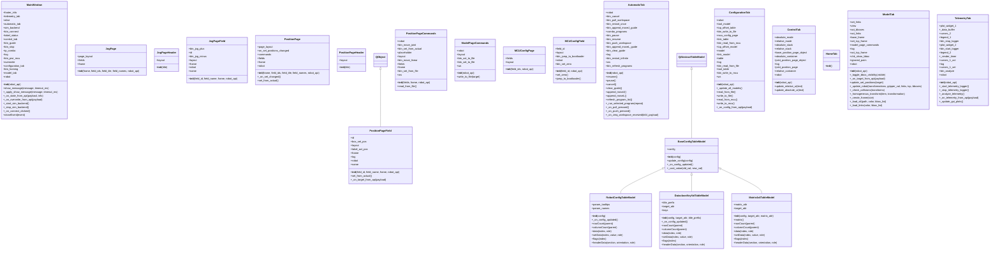

# Gui Architecture

```mermaid
classDiagram
    class MainWindow {
        +footer_info
        +telemetry_tab
        +alive
        +automatic_tab
        +sim_backend
        +btn_connect
        +label_status
        +control_tab
        +btn_guide
        +btn_stop
        +ip_combo
        +log
        +btn_pwr_mcu
        +overwrite
        +configuration_tab
        +btn_homing
        +model_tab
        +robot
        +__init__(robot_api)
        +show_message(message, timeout_ms)
        +_apply_show_message(message, timeout_ms)
        +_on_state_from_api(payload, info)
        +_on_overwrite_from_api(payload)
        +_start_sim_backend()
        +_stop_sim_backend()
        +_on_connect_clicked()
        +closeEvent(event)
    }
    class JogPage {
        +page_layout
        +fields
        +frame
        +__init__(frame, field_ids, field_tile, field_names, robot_api)
    }
    class JogPageHeader {
        +layout
        +__init__(title)
    }
    class JogPageField {
        +btn_jog_plus
        +id
        +btn_jog_minus
        +layout
        +frame
        +robot
        +name
        +__init__(field_id, field_name, frame, robot_api)
    }
    class PositionPage {
        +page_layout
        +on_set_positions_changed
        +commands
        +fields
        +frame
        +robot
        +__init__(frame, field_ids, field_tile, field_names, robot_api)
        +_on_set_changed()
        +set_from_actual()
    }
    class PositionPageHeader {
        +layout
        +__init__(title)
    }
    class PositionPageField {
        +id
        +box_set_pos
        +layout
        +label_act_pos
        +frame
        +log
        +robot
        +name
        +__init__(field_id, field_name, frame, robot_api)
        +set_from_actual()
        +_on_target_from_api(payload)
    }
    QObject <|-- PositionPageField
    class PositionPageCommands {
        +robot
        +btn_move_joint
        +btn_set_from_actual
        +placeholder
        +layout
        +btn_move_linear
        +fields
        +frame
        +btn_set_from_file
        +ws
        +__init__(fields, frame, robot_api)
        +read_from_file()
    }
    class ModelPageCommands {
        +robot
        +layout
        +btn_act_to_file
        +btn_set_to_file
        +ws
        +__init__(robot_api)
        +write_to_file(target)
    }
    class MCUConfigPage {
        +fields
        +layout
        +__init__(field_ids, robot_api)
    }
    class MCUConfigField {
        +field_id
        +layout
        +btn_jump_to_bootloader
        +robot
        +btn_set_zero
        +__init__(field_id, robot_api)
        +set_zero()
        +jump_to_bootloader()
    }
    class AutomaticTab {
        +robot
        +btn_cancel
        +btn_pull_workspace
        +btn_restart_once
        +btn_append_moveJ_guide
        +combo_programs
        +btn_pause
        +btn_resume
        +btn_push_workspace
        +btn_append_moveL_guide
        +btn_clear_guide
        +log
        +btn_restart_infinite
        +ws
        +btn_refresh_programs
        +__init__(robot_api)
        +resume()
        +pause()
        +cancel()
        +clear_guide()
        +append_moveJ()
        +append_moveL()
        +refresh_program_list()
        +_run_selected_program(repeat)
        +_on_pull_pressed()
        +_on_push_pressed()
        +_on_zmq_workspace_received(b64_payload)
    }
    class BaseConfigTableModel {
        +config
        +__init__(config)
        +update_config(config)
        +_on_config_updated()
        +_cast_value(old_val, new_val)
    }
    QAbstractTableModel <|-- BaseConfigTableModel
    class RobotConfigTableModel {
        +param_tooltips
        +param_names
        +__init__(config)
        +_on_config_updated()
        +rowCount(parent)
        +columnCount(parent)
        +data(index, role)
        +setData(index, value, role)
        +flags(index)
        +headerData(section, orientation, role)
    }
    BaseConfigTableModel <|-- RobotConfigTableModel
    class DataclassKeyValTableModel {
        +title_prefix
        +target_attr
        +keys
        +__init__(config, target_attr, title_prefix)
        +_on_config_updated()
        +rowCount(parent)
        +columnCount(parent)
        +data(index, role)
        +setData(index, value, role)
        +flags(index)
        +headerData(section, orientation, role)
    }
    BaseConfigTableModel <|-- DataclassKeyValTableModel
    class Matrix4x4TableModel {
        +matrix_attr
        +target_attr
        +__init__(config, target_attr, matrix_attr)
        +matrix()
        +rowCount(parent)
        +columnCount(parent)
        +data(index, role)
        +setData(index, value, role)
        +flags(index)
        +headerData(section, orientation, role)
    }
    BaseConfigTableModel <|-- Matrix4x4TableModel
    class ConfigurationTab {
        +robot
        +tool_model
        +tcp_offset_table
        +btn_write_to_file
        +mcu_config_page
        +link_table
        +btn_read_from_mcu
        +tcp_offset_model
        +model
        +link_model
        +table
        +log
        +btn_read_from_file
        +tool_table
        +btn_write_to_mcu
        +ws
        +__init__(robot_api)
        +_update_all_models()
        +read_from_file()
        +write_to_file()
        +read_from_mcu()
        +write_to_mcu()
        +_on_config_from_api(payload)
    }
    class ControlTab {
        +absolute_mode
        +relative_mode
        +absolute_stack
        +relative_stack
        +base_position_page_object
        +absolute_container
        +joint_position_page_object
        +log
        +joint_position_page
        +relative_container
        +robot
        +__init__(robot_api)
        +update_relative_ui(text)
        +update_absolute_ui(text)
    }
    class HomeTab {
        +__init__()
    }
    class ModelTab {
        +set_links
        +view
        +act_bboxes
        +act_links
        +base_frame
        +set_tcp_frame
        +model_page_commands
        +log
        +act_tcp_frame
        +chk_show_bbox
        +ignored_pairs
        +robot
        +__init__(robot_api)
        +_toggle_bbox_visibility(visible)
        +_on_target_from_api(payload)
        +update_set_positions(target)
        +_update_robot(transformations, gripper_val, links, tcp, bboxes)
        +_check_collisions(transforms)
        +_homogeneous_transform(item, transformation)
        +_create_frame(size)
        +_load_stl(path, color, bbox_list)
        +_load_links(color, bbox_list)
    }
    class TelemetryTab {
        +plot_widget_1
        +_data_buffer
        +curves_2
        +legend_1
        +btn_stop_logger
        +plot_widget_2
        +btn_start_logger
        +legend_2
        +_render_timer
        +curves_1_act
        +log
        +curves_1_set
        +btn_analyze
        +robot
        +__init__(robot_api)
        +_start_telemetry_logger()
        +_stop_telemetry_logger()
        +_analyze_telemetry()
        +_on_telemetry_from_api(payload)
        +_update_gui_plots()
    }
```