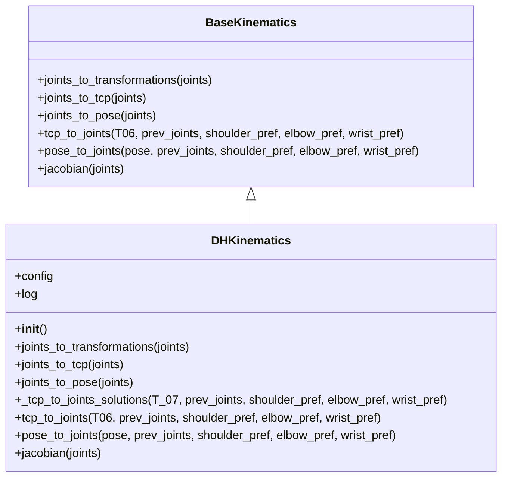

# Kinematics Architecture

```mermaid
classDiagram
    class BaseKinematics {
        +joints_to_transformations(joints)
        +joints_to_tcp(joints)
        +joints_to_pose(joints)
        +tcp_to_joints(T06, prev_joints, shoulder_pref, elbow_pref, wrist_pref)
        +pose_to_joints(pose, prev_joints, shoulder_pref, elbow_pref, wrist_pref)
        +jacobian(joints)
    }
    class DHKinematics {
        +config
        +log
        +__init__()
        +joints_to_transformations(joints)
        +joints_to_tcp(joints)
        +joints_to_pose(joints)
        +_tcp_to_joints_solutions(T_07, prev_joints, shoulder_pref, elbow_pref, wrist_pref)
        +tcp_to_joints(T06, prev_joints, shoulder_pref, elbow_pref, wrist_pref)
        +pose_to_joints(pose, prev_joints, shoulder_pref, elbow_pref, wrist_pref)
        +jacobian(joints)
    }
    BaseKinematics <|-- DHKinematics
```