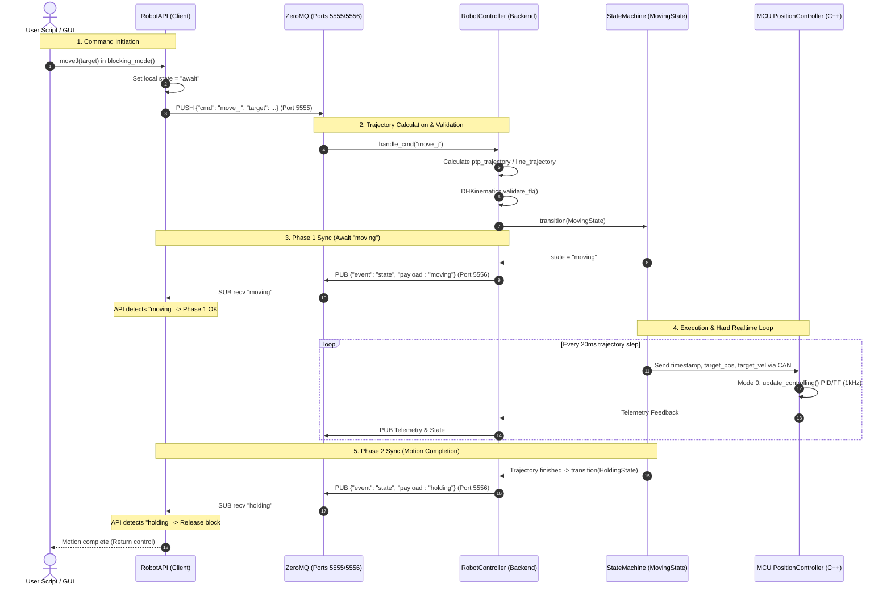

# Use-Case

```mermaid

sequenceDiagram
    autonumber
    actor User as User Script / GUI
    participant API as RobotAPI (Client)
    participant ZMQ as ZeroMQ (Ports 5555/5556)
    participant RC as RobotController (Backend)
    participant SM as StateMachine (MovingState)
    participant MCU as MCU PositionController (C++)

    Note over User, API: 1. Command Initiation
    User->>API: moveJ(target) in blocking_mode()
    API->>API: Set local state = "await"
    API->>ZMQ: PUSH {"cmd": "move_j", "target": ...} (Port 5555)

    Note over ZMQ, RC: 2. Trajectory Calculation & Validation
    ZMQ->>RC: handle_cmd("move_j")
    RC->>RC: Calculate ptp_trajectory / line_trajectory
    RC->>RC: DHKinematics.validate_fk()
    RC->>SM: transition(MovingState)
    
    Note over RC, API: 3. Phase 1 Sync (Await "moving")
    SM->>RC: state = "moving"
    RC->>ZMQ: PUB {"event": "state", "payload": "moving"} (Port 5556)
    ZMQ-->>API: SUB recv "moving"
    Note over API: API detects "moving" -> Phase 1 OK

    Note over SM, MCU: 4. Execution & Hard Realtime Loop
    loop Every 20ms trajectory step
        SM->>MCU: Send timestamp, target_pos, target_vel via CAN
        MCU->>MCU: Mode 0: update_controlling() PID/FF (1kHz)
        MCU->>RC: Telemetry Feedback
        RC->>ZMQ: PUB Telemetry & State
    end

    Note over SM, API: 5. Phase 2 Sync (Motion Completion)
    SM->>RC: Trajectory finished -> transition(HoldingState)
    RC->>ZMQ: PUB {"event": "state", "payload": "holding"} (Port 5556)
    ZMQ-->>API: SUB recv "holding"
    Note over API: API detects "holding" -> Release block
    API-->>User: Motion complete (Return control)

```